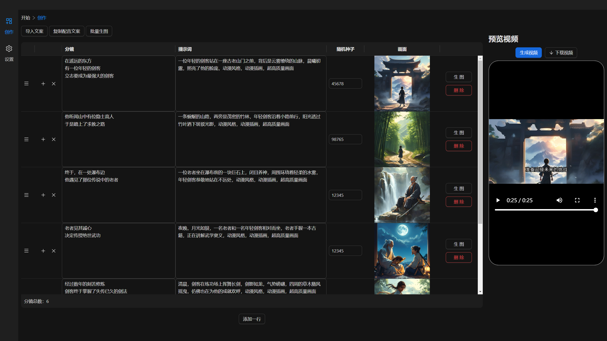
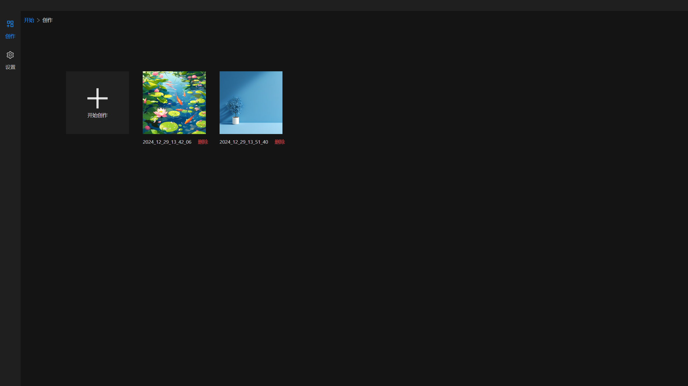
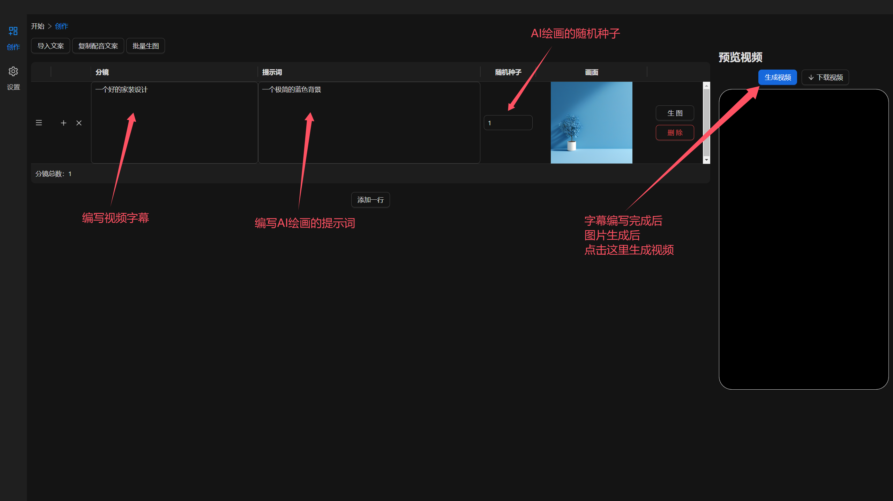

<p align="left">
    中文</a>&nbsp ｜ &nbsp<a href="README_EN.md">English</a>&nbsp
</p>
<div align="center">
  <a href='https://github.com/coralf/ai-video-creation'></a>
</div>

# AI Video Creation

## 概述

AI Video Creation 是一个开源项目，旨在利用人工智能技术自动生成艺术作品，包括视频、图像等。该项目结合了文本转语音（ChatTTS）、语音识别（Whisper）、图像生成等多种技术。

<div align="center">
  
</div>

## 特性

- **🚀文本转语音**：将文本转换为高质量的语音音频。
- **🚀语音识别**：将音频文件转换为字幕文件（SRT）。
- **🚀视频生成**：根据字幕和图像生成视频。
- **🚀视频项目管理**：管理多个视频项目，包括创建、删除和查看项目。

## 技术栈

- **前端**：React, TypeScript, Ant Design
- **后端**：Python, FastAPI, PyDub, Whisper, ChatTTS, Kolors

## 安装指南

### 前提
* 建议 conda 创建虚拟环境
* 需要 python 3.12 版本
* 建议 node 环境 18 及以上版本
* 需要安装 ffmpeg
* 建议在 linux 环境下进行安装，其他平台未测试

### 克隆仓库

```bash
git clone https://github.com/coralf/ai-creation.git
```

### 前端

**安装依赖**
```bash
cd ai-creation/frontend
npm install
```

**运行前端**
```bash
npm start
```

### 后端

**安装依赖**
```bash
pip install poetry
poetry install
```

**运行后端**
```bash
cd ai-creation/backend
python run.py
```

## 使用说明


### 创建视频项目

1. **访问前端应用**
    打开浏览器，访问 `http://localhost:3000`。

2. **创建新项目**
    点击“开始创作”按钮
    <div align="center">
        
    </div>

### 基础使用
1. 编写分镜的字幕文案
    * 一张图片播放可能有一句或多句话，在一个单元格里面使用换行来分割多句画

2. 提示词：AI绘画模型是使用的Kolors，请直接使用中文编写提示词

3. 随机种子：通过调整这个数，用来生成不同的图片

4. 生成视频：当所有分镜的字幕文案编写完成后，所有图片也生成后，点击生成视频按钮，即可生成视频。
    > 生成视频同时在生成音频，字幕，图片过渡动画等，可能需要较长的时间
    <div align="center">
        
    </div>

## 设置
### 音频设置
点击试听后，生成视频时会按照试听的声音进行生成音频
    <div align="center">
        
    </div>

## TODOS
- [ ] 支持字幕设置颜色，大小，位置
- [ ] 支持视频设置分辨率，帧率
- [ ] 支持单个分镜动态视频生成（stable video diffusion系列模型）
- [ ] 支持GPT-SoVITS
- [ ] 支持开源大语言模型实现自动创作

## 可以在这里一起讨论技术闲聊

Q群: 1014339289

## 贡献指南

### 提交问题

如果你发现任何问题或有改进建议，请在 [Issues](https://github.com/coralf/ai-video-creation/issues) 页面提交问题。

## 许可证

本项目采用 [MIT 许可证](LICENSE)。

---

希望这个 `README.md` 文档能帮助你更好地介绍和维护 `ai-video-creation` 项目！如果有任何进一步的需求或修改，请随时告知。


## Star History

[](https://star-history.com/#coralf/ai-video-creation&Date)