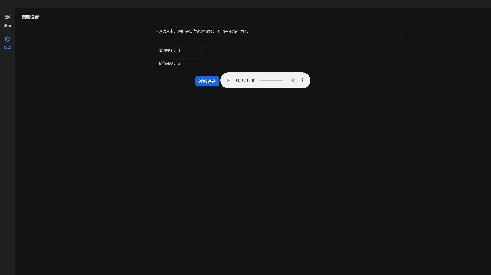

<p align="left">
    <a href="README.md">中文</a>&nbsp ｜ &nbspEnglish
</p>
<div align="center">
  <a href='https://github.com/coralf/ai-video-creation'></a>
</div>

# AI Video Creation

## Overview

AI Video Creation is an open-source project aimed at automatically generating artistic works using artificial intelligence technology, including videos, images, and more. This project integrates multiple technologies such as text-to-speech (ChatTTS), speech recognition (Whisper), image generation, etc.

<div align="center">
  
</div>

## Features

- **🚀 Text-to-Speech**: Converts text into high-quality speech audio.
- **🚀 Speech Recognition**: Converts audio files into subtitle files (SRT).
- **🚀 Video Generation**: Generates videos based on subtitles and images.
- **🚀 Video Project Management**: Manages multiple video projects, including creation, deletion, and viewing of projects.

## Technology Stack

- **Frontend**: React, TypeScript, Ant Design
- **Backend**: Python, FastAPI, PyDub, Whisper, ChatTTS, Kolors

## Installation Guide

### Prerequisites
* It is recommended to create a virtual environment using conda.
* Requires Python version 3.12.
* Node.js environment version 18 or higher is recommended.
* FFmpeg needs to be installed.
* It is recommended to install in a Linux environment; other platforms have not been tested.

### Clone the Repository

```bash
git clone https://github.com/coralf/ai-creation.git
```

### Frontend

**Install Dependencies**
```bash
cd ai-creation/frontend
npm install
```

**Run the Frontend**
```bash
npm start
```

### Backend

**Install Dependencies**
```bash
pip install poetry
poetry install
```

**Run the Backend**
```bash
cd ai-creation/backend
python run.py
```

## Usage Instructions

### Create a Video Project

1. **Access the Frontend Application**
   Open your browser and visit `http://localhost:3000`.

2. **Create a New Project**
   Click the "Start Creation" button
   <div align="center">
       
   </div>

### Basic Usage
1. Write the subtitle script for storyboards
   * One image may correspond to one or more sentences. Use line breaks within a cell to separate multiple sentences.

2. Prompt Words: The AI painting model used is Kolors. Please write prompt words directly in Chinese.

3. Random Seed: Adjust this number to generate different images.

4. Generate Video: After completing all storyboard subtitle scripts and generating all images, click the "Generate Video" button to create the video.
   > Generating the video simultaneously generates audio, subtitles, image transitions, etc., which may take a long time.
   <div align="center">
       
   </div>

## Configuration
### Audio Setting
After clicking on the preview, audio will be generated according to the sound of the preview when generating the video
    <div align="center">
        
    </div>

## TODOS
- [ ] Support subtitle color, size, and position settings
- [ ] Support video resolution and frame rate settings
- [ ] Support dynamic video generation for individual storyboards (using stable video diffusion models)
- [ ] Support GPT-SoVITS
- [ ] Support automatic creation using open-source large language models

## Contribution Guidelines

### Submitting Issues

If you find any issues or have suggestions for improvement, please submit them on the [Issues](https://github.com/coralf/ai-video-creation/issues) page.

## License

This project is licensed under the [MIT License](LICENSE).

---

We hope this `README.md` document helps you better introduce and maintain the `ai-video-creation` project! If you have any further requirements or modifications, feel free to let us know.

## Star History

[](https://star-history.com/#coralf/ai-video-creation&Date)